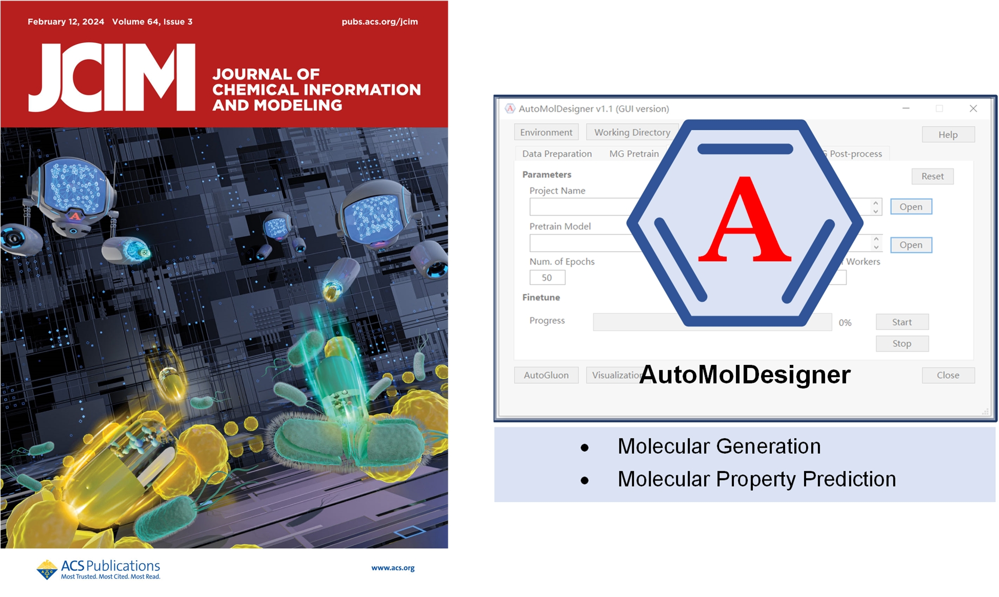

# AutoMolDesigner V1.1
[](https://doi.org/10.5281/zenodo.10097899)
## Introduction
<center class="half">
    
</center>

**AutoMolDesigner** is a computer-aided drug design software that enables automated design and screening of drug-like molecules through combination of chemical language model and automated machine learning (AutoML) framework. This open-source repository holds its command-line interface (CLI) version. It was developed on Linux (Ubuntu 22.04 LTS) with Python3，and it has also been tested on Windows and MacOS. Moreover, we provide the graphical user interface (GUI) version of this software that has been tested on Windows and  MacOS. The ready-to-use software packages are freely available at [Zenodo](https://doi.org/10.5281/zenodo.10097899), wherein the user manual along with all datasets and trained models is also available. 


## Requirements
* This tool supports CUDA-enabled GPU and can also run on CPU with limited performance.
* Basic requirements are `Python>=3.8`, `pytorch>=1.13.1` and `autogluon>=0.8.2`, other packages including `rdkit`, `molvs`, `descriptastorus`, `dimorphite-dl`, `openpyxl` and so on.

## Installation
Hereinafter, the command lines are bash scripts.

0) Install [Anaconda](https://www.anaconda.com/download) and [Git](https://git-scm.com/downloads).
1) Clone this repository and navigate to it:
```bash
$ git clone https://github.com/taoshen99/AutoMolDesigner.git
$ cd AutoMolDesigner
```
2) Create the `conda` environment called `automoldesigner`:
```bash
$ conda env create -f environment.yml
```
3) Activate the environment:
```bash
$ conda activate automoldesigner
```

## Usage
This software is composed of two sub-modules, i.e., **deep molecular generation** and **molecular property prediction**. The first module aims at establishing focused virtual libraries with generative deep learning, and the second module employs AutoML-based predictive model to prioritize the most promising molecules from virtual libraries. The combination of two sub-modules can facilitate experimental chemists to fast conceptualize novel candidates for new projects. However, they can also take advantage of the independent module to train customized models to satisfy various demands.  

### Deep molecular generation

This software implements deep molecular generation with chemical language model based on recurrent neural networks. The complete workflow includes **Pretrain**, **Finetune** and **Sample**. To build the model and sample molecules from scratch, one should execute the following commands in sequence. However, one can also run each module independently as long as the corresponding requirements are met. 

#### Pretrain
Model pretraining aims at learning the basic grammar of chemical language, and moreover, excavating the intrinsic features of drug-like molecules. We have provided the [pretrained model](projects/ChEMBL32-pretrain-linux/CLM-pretrain_best-29-0.0327.pkl) (trained with millions of drug-like small molecules from ChEMBL32). To pretrain your own model, you should have the drug-like molecules (hundreds of thousands to millions):
1) Deposit and curate the molecules for pretraining (`datasets/pretrain-chembl-mini.smi` raw molecules for pretraining, one SMILES sequence per row):
```bash
$ python prep_smi.py -i datasets/pretrain-chembl-mini.smi -o datasets/pretrain-chembl-mini_preped.smi -a 5 -u
```
Curation includes:
* Standardizing molecules, removing duplicates, salts and stereo information.
* Using `-a` to declare data augmentation with [SMILES Enumeration](https://github.com/EBjerrum/SMILES-enumeration) (herein, augment five fold).
* Using `-u` to declare neutralization of molecules.
2) Compile the config for pretraining:
`template_pretrain.json`  under `template` : rename `prj_name` with your project name, change `pretrain_data` to your path of pretraining data `datasets/pretrain-chembl-mini_preped.smi` and leave other parameters as default (recommended).

3) Do pretraining with compiled config:
```bash
$ python pretrain.py
```
After each iteration of the whole data, the model will be deposited at `projects/{prj_name}/` if the validation loss decreases. The pretraining process will be terminated if no progress of validation loss is made during five consecutive epochs. The best model is deposited as `CLM-pretrain_best-{epoch}-{validation loss}.pkl`

#### Finetune
Model finetuning is an effective strategy to navigate molecular generation to the focused chemical space of interest. To finetune your own model, you should have both the pretrained model and molecules of interest (tens to thousands). Herein, we take the generation of virtual library for antibacterial small molecules against *Escherichia coli (E. coli)* as an guiding example:
1) Deposit and curate the molecules for finetuning (In this case, we have prepared the [dataset for finetuning](datasets/finetune-Ecoli-32ugmL-preped.smi); see manuscript for detailed description):

2) Compile the config for finetuning:
`template_finetune.json` under `template`: rename `prj_name` with your project name, change `finetune_data` to your path of finetuning data  and change `pretrain_model` to your path of pretrain_model. You may adjust the `batch_size` according to your data size. Leave other parameters as default (recommended).

3) Do finetuning with compiled config:
```bash
$ python finetune.py
```
After each iteration of the whole data, the model will be deposited at `projects/{prj_name}/` if the validation loss decreases. The finetuning process will be terminated if no progress of validation loss is made during five consecutive epochs. The best model is deposited as `CLM-finetune_best-{epoch}-{validation loss}.pkl`

#### Sample
Model sampling is to generate the desired number of molecules represented by SMILES. To sample molecules, you should have the trained model (either pretrained one or finetuned one):
1) Compile the config for sampling:
`template_sample.json` under `template`: rename `prj_name` with your project name and change `trained_model` to your path of trained model. You may adjust the `sampling_num` to obatin specific number of molecules. The parameter `sampling_temp` affects the validity and novelty of sampled SMILES, detailed illustration can be referred to [Gupta et al.](https://onlinelibrary.wiley.com/doi/full/10.1002/minf.201700111).

2) Do sampling with compiled config:
```bash
$ python sample.py
```
The sampled SMILESs are available at `projects/{prj_name}/sampled_SMILES.smi`.

#### Postprocess
This additional module provides curations for raw sampled molecules in order to remove invalid and duplicated SMILES:
Check `Validity` and `Uniqueness`:
```bash
$ python post_process.py -i raw_sampled.smi -o curated_sampled.smi
```
To check `Novelty` additionally, you should provide the molecules for training with `-k`:
```bash
$ python post_process.py -i raw_sampled.smi -o curated_sampled.smi -k known_training.smi
```
The definitions of `Validity`, `Uniqueness` and `Novelty` can be referred to [Polykovskiy et al.](https://www.frontiersin.org/articles/10.3389/fphar.2020.565644/full).

### Molecular property prediction

This software implements molecular property prediction with AutoGluon, an open-source AutoML framework developed by Amazon Co. Ltd.,. It takes molecular descriptors as input and can be applied for both binary classification tasks and regression tasks. Two modes are provided, i.e., retrospective benchmarking and prospective prediction. Herein, we provide a case study on screening active antibacterial small molecules against *E. coli* as a basic guideline.

#### Data curation

The raw active data was retrieved from ChEMBL32, and further curated to make corresponding Maximal Unbiased Benchmarking Datasets (MUBD) with [MUBD-DecoyMaker 2.0](https://github.com/jwxia2014/MUBD-DecoyMaker2.0) (see manuscript for detailed description). The curated datasets were provided as `MIC_train.xlsx`. User can still take `prep_smi.py` to curate raw data (this script also supports .csv and .xlsx file, see [template](datasets/ag-MIC-mini.xlsx)) and `-p` is additionally provided to protonate molecules at a certain range of pH.   

#### Model training

The training config is provided as `template_ag_train.json` . To customize your training,  follow the instructions below:

| argument    | description                                                  |
| :---------- | :----------------------------------------------------------- |
| prj_name    | name of the project that will be created under the directory of `projects` |
| train_data  | directory of tabular data file for training, it should contain two columns, the first column is named "SMILES" containing prepared molecules and the second is named "label" containing binary label (0, 1) or continuous numerical value; support file suffix with csv and xlsx |
| test_size   | [0, 1), fraction of test data split from input train data, 0 means no data will be held out for testing |
| features    | molecular descriptors, one of {`'ecfp4'`, `'fcfp6'`, `'maccs'`, `'rdkit_2d'`, `'rdkit_2d_norm'`} |
| eval_metric | metrics used to evaluate model performance during training, one of {`'f1'`, `'roc_auc'`, `'mean_absolute_error'`, `'root_mean_squared_error'`} |
| quality     | presets of AutoGluon model quality, better quality consumes more resources, one of {`'medium quality'`, `'good_quality'`, `'high_quality'`, `'best_quality'`} |
| time_limit  | maximum amount of time (in seconds) for model training       |
| opt_deploy  | whether to perform deployment optimization                   |

```bash
$ python ag_train.py
```

The trained AutoGluon models will be saved as `projects/{prj_name}/ag_models`. If `test_size` is not zero, the split train and test data will be saved as `ag_train.csv` and `ag_test.csv`. 

#### Model prediction 

The predicting config is provided as `template_ag_predict.json` . To predict new data or perform benchmarking, follow the instructions below:

| argument   | description                                                  |
| :--------- | :----------------------------------------------------------- |
| prj_name   | name of the project that will be created under the directory of `projects` |
| smiles_dir | directory of new data for prediction or test data for benchmarking, if new data prediction required, the data file should be plain text with one SMILES sequence per row, and end with `.smi`; if benchmark required, the data file should be test data generated during model training, for example, `ag_test.csv` (also support .xlsx) |
| model_dir  | directory of AutoGluon models, for example,  `projects/{prj_name}/ag_models` |
| features   | molecular descriptors used in model training, one of {`'ecfp4'`, `'fcfp6'`, `'maccs'`, `'rdkit_2d'`, `'rdkit_2d_norm'`} |
```bash
$ python ag_predict.py 
```

If the model is used for new data prediction, the prediction results will be saved under the directory of `projects/{prj_name}` ending with `.csv` and `.sdf`. Otherwise, if the model is used for benchmark, the model performance will be saved as `projects/{prj_name}/metrics.csv`.

## Acknowledgements

The AutoML framework in this work adopted [AutoGluon](https://github.com/autogluon/autogluon), see its [documentation](https://auto.gluon.ai/stable/index.html) for advanced usage. Please cite their reported work [AutoGluon-Tabular: Robust and Accurate AutoML for Structured Data](https://arxiv.org/abs/2003.06505) if molecular property prediction module in this application is used. 

We appreciate the developers of [Dimorphite-DL](https://github.com/Sulstice/dimorphite_dl). We directly use that computational tool to protonate raw actives. It is highly recommended to cite their publication [Dimorphite-DL: an open-source program for enumerating the ionization states of drug-like small molecules](https://jcheminf.biomedcentral.com/articles/10.1186/s13321-019-0336-9), if you use this module in your work. 

The tokenization method for SMILES and Temperature Sampling technique referred to [LSTM_Chem](https://github.com/topazape/LSTM_Chem) that was developed by Gupta et al., who contributed to the early establishment of chemical language model.

## Citation

If you use AutoMolDesigner or related materials, please cite:

Shen, T.; Guo, J.; Han, Z.; Zhang, G.; Liu, Q.; Si, X.; Wang, D.; Wu, S.; Xia, J., AutoMolDesigner for Antibiotic Discovery: An AI-Based Open-Source Software for Automated Design of Small-Molecule Antibiotics. *J. Chem. Inf. Model.* 2024, 64, 575-583.

or BibTex:

```bibtex
@article{doi:10.1021/acs.jcim.3c01562,
author = {Shen, Tao and Guo, Jiale and Han, Zunsheng and Zhang, Gao and Liu, Qingxin and Si, Xinxin and Wang, Dongmei and Wu, Song and Xia, Jie},
title = {AutoMolDesigner for Antibiotic Discovery: An AI-Based Open-Source Software for Automated Design of Small-Molecule Antibiotics},
journal = {Journal of Chemical Information and Modeling},
volume = {64},
number = {3},
pages = {575-583},
year = {2024},
doi = {10.1021/acs.jcim.3c01562},
note = {PMID: 38265916},
URL = {https://doi.org/10.1021/acs.jcim.3c01562},
eprint = {https://doi.org/10.1021/acs.jcim.3c01562}
}
```